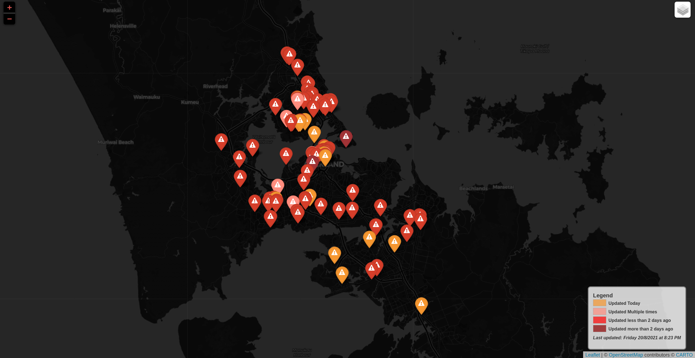

# NZ CovidMap Scraper and Map



This application scraped the ministry of health website during the opening weeks of the New Zealand delta outbreak and provided an "always up to date" folium map.

# Install

Install the requirements:

```
pip3 install -r requirements.txt
```

Add main.py to your cron.

```
* 1 * * * * main.py &> /dev/null
```

This updates the static files in `public`, which can then be served. This was chosen as this approach is far more scalable than a direct web application (using, for instance, flask).

# Data

This comes with the last set of data collected before MOH permanently changed their website and table method to a search based approach. This was quickly followed by an official map, which meant there was no longer a need for third party maps like this. Sometime later, the official geojson was made avaliable as well.

# Process

This python file is made up of three main components:

- A scraper
- A geojson aggregator
- Folium map generator

# Disclaimer

This is provided as is for the purposes of education only. This map generator is no longer functional. You are free to use any components of this for any purpose personal or commerical.